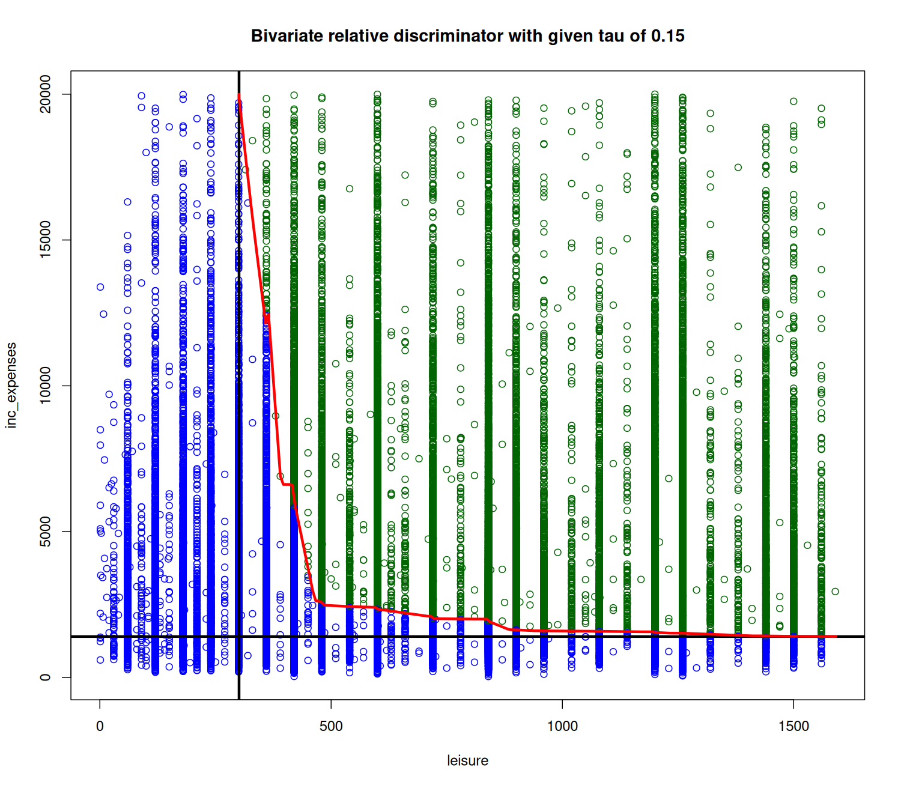

# BRPL

[](https://www.tidyverse.org/lifecycle/#experimental)
[](https://CRAN.R-project.org/package=BRPL)


BRPL is an R package that provides methods for identifying subgroups within populations based on their individual response patterns to a specific intervention or treatment. 
It enables researchers and clinicians to investigate heterogeneous treatment effects and develop personalized therapy approaches.
hence offering functions to analyze and visualize the interplay between two variables, aiding in the understanding of social sustainability metrics.
The overall goal of `BRPL` is to provide tools for bivariate discriminant analysis, focusing on the relationship between variable indicators. 

## Installation

You can install the development version of `BRPL` from [GitHub](https://github.com/FranziskaDorn/BRPL) with:

To install BRPL, you first need to have the `devtools` package installed. 
If you don't have it yet, you can install it using:

```r
# Install devtools if you haven't already
install.packages("devtools")
```
Then, you can install BRPL from GitHub using:

```r
# Install BRPL package
devtools::install_github("FranziskaDorn/BRPL")
```

## Functions
BRPL provides several key functions for performing bivariate response profile learning:

`brpl()`: This function performs the core Profile Learning analysis. It takes a data frame of individual response data as input and returns a list of results, including the identified subgroups, their characteristic response patterns of each subgroup.

`plot_profiles()`: This function visualizes the identified subgroups and their response patterns. It generates a plot that shows the mean response of each subgroup across the different items or time points, along with confidence intervals or credible intervals.

`summary_brpl()`: This function provides a summary of the BRPL results, including the number of identified subgroups, the proportion of individuals in each subgroup, and the overall model fit.

```


<!-- README.md is generated from README.Rmd. Please edit that file -->


## Example

Here’s a basic example demonstrating how to use the main function of the BRPL package:

``` r
# Load the BRPL package
library(BRPL)


# Load the example dataset
data("nutritionpoverty")

# Perform bivariate discriminant analysis
result <- brpl(data = nutritionpoverty, var1 = "NUval", var2 = "INval", tau = 0.25)

# Print a summary of the results
summary_brpl(results)

# Plot the results
plot_profiles(result)

```

This example utilizes the nutritionpoverty dataset included in the package and applies the bivqfun function to analyze the relationship between the variables NUval (nutrition value) and INval (income value) with a specified threshold (tau) of 0.25.




## Advantages and Distinguishing Features

BRPL offers several advantages over other methods for subgroup identification:

- Bayesian approach: BRPL uses a approach, which allows the estimation of subgroup parameters.
- Flexibility: BRPL can handle various types of response data, including continuous, binary, and count data.
- Interpretability: BRPL provides clear and interpretable results, making it easy to understand the identified subgroups and their response patterns.

## Documentation
For more detailed information and examples, please refer to the package vignettes:
```r
browseVignettes("BRPL")
```

## License

This project is licensed under the MIT License. See the LICENSE.md file for details.

## Contact and Contributing

Contributions are welcome! Please open an issue or submit a pull request for any bugs, enhancements, or suggestions.
If you have any questions or suggestions, please feel free to contact the maintainer.

Franziska Dorn: [insert email address here]
Contributions to BRPL are welcome! If you would like to contribute, please submit a pull request on GitHub.


## Acknowledgments

Special thanks to all contributors and the open-source community for their invaluable support and resources.
